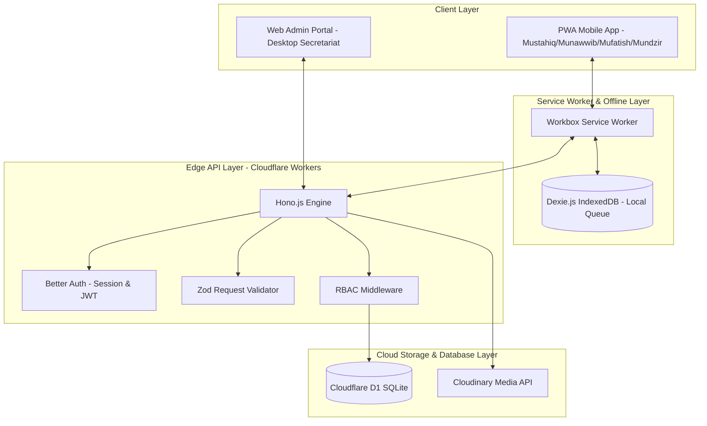

# 07. Enterprise System Architecture Specification

## Diagram Arsitektur Komponen

```mermaid
graph TD
    subgraph Client Layer
        PWA[PWA Mobile App - Mustahiq/Munawwib/Mufatish/Mundzir]
        ADMIN[Web Admin Portal - Desktop Secretariat]
    end

    subgraph Service Worker & Offline Layer
        SW[Workbox Service Worker]
        IDB[(Dexie.js IndexedDB - Local Queue)]
    end

    subgraph Edge API Layer - Cloudflare Workers
        HONO[Hono.js Engine]
        AUTH[Better Auth - Session & JWT]
        ZOD[Zod Request Validator]
        RBAC[RBAC Middleware]
    end

    subgraph Cloud Storage & Database Layer
        D1[(Cloudflare D1 SQLite)]
        CLD[Cloudinary Media API]
    end

    PWA <--> SW
    SW <--> IDB
    SW <--> HONO
    ADMIN <--> HONO
    HONO --> AUTH
    HONO --> ZOD
    HONO --> RBAC
    RBAC --> D1
    HONO --> CLD
```
