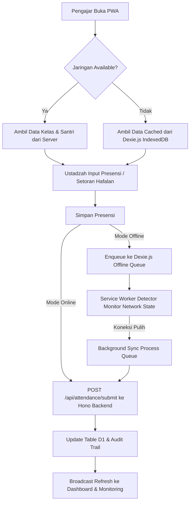

# 131. Detailed System Workflow Specifications

## Alur Kerja Presensi & Sync Offline PWA

```mermaid
flowchart TD
    A[Pengajar Buka PWA] --> B{Jaringan Available?}
    B -- Ya --> C[Ambil Data Kelas & Santri dari Server]
    B -- Tidak --> D[Ambil Data Cached dari Dexie.js IndexedDB]
    C --> E[Ustadzah Input Presensi / Setoran Hafalan]
    D --> E
    E --> F[Simpan Presensi]
    F -- Mode Online --> G[POST /api/attendance/submit ke Hono Backend]
    F -- Mode Offline --> H[Enqueue ke Dexie.js Offline Queue]
    H --> I[Service Worker Detector Monitor Network State]
    I -- Koneksi Pulih --> J[Background Sync Process Queue]
    J --> G
    G --> K[Update Table D1 & Audit Trail]
    K --> L[Broadcast Refresh ke Dashboard & Monitoring]
```
