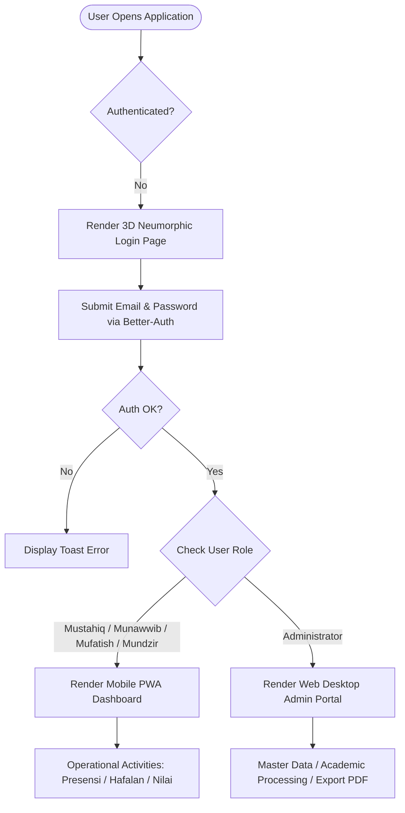

# 140. Main System Flowcharts

```mermaid
flowchart TD
    Start([User Opens Application]) --> AuthCheck{Authenticated?}
    AuthCheck -- No --> LoginScreen[Render 3D Neumorphic Login Page]
    LoginScreen --> SubmitAuth[Submit Email & Password via Better-Auth]
    SubmitAuth --> AuthSuccess{Auth OK?}
    AuthSuccess -- No --> ShowError[Display Toast Error]
    AuthSuccess -- Yes --> RoleCheck{Check User Role}
    
    RoleCheck -- Mustahiq / Munawwib / Mufatish / Mundzir --> PWADashboard[Render Mobile PWA Dashboard]
    RoleCheck -- Administrator --> AdminPortal[Render Web Desktop Admin Portal]
    
    PWADashboard --> DailyWork[Operational Activities: Presensi / Hafalan / Nilai]
    AdminPortal --> AdminWork[Master Data / Academic Processing / Export PDF]
```
