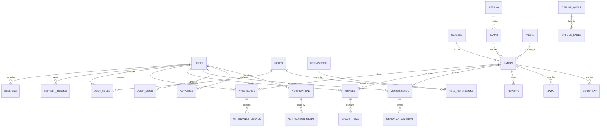

# 70. Visual Entity Relationship Diagram (ERD)

```mermaid
erDiagram
    USERS ||--o{ SESSIONS : "has active"
    USERS ||--o{ REFRESH_TOKENS : "owns"
    USERS ||--o{ USER_ROLES : "assigned"
    ROLES ||--o{ USER_ROLES : "defines"
    ROLES ||--o{ ROLE_PERMISSIONS : "contains"
    PERMISSIONS ||--o{ ROLE_PERMISSIONS : "grants"
    
    CLASSES ||--o{ SANTRI : "enrolls"
    ASRAMA ||--o{ KAMAR : "contains"
    KAMAR ||--o{ SANTRI : "houses"
    
    USERS ||--o{ ATTENDANCE : "records"
    SANTRI ||--o{ ATTENDANCE : "has"
    ATTENDANCE ||--o{ ATTENDANCE_DETAILS : "includes"
    
    USERS ||--o{ GRADES : "inputs"
    SANTRI ||--o{ GRADES : "receives"
    GRADES ||--o{ GRADE_ITEMS : "contains"
    
    USERS ||--o{ MEMORIZATION : "evaluates"
    SANTRI ||--o{ MEMORIZATION : "submits"
    MEMORIZATION ||--o{ MEMORIZATION_ITEMS : "details"
    
    SANTRI ||--o{ REPORTS : "owns"
    SANTRI ||--o{ IJAZAH : "awarded"
    SANTRI ||--o{ SERTIFIKAT : "earned"
    
    USERS ||--o{ AUDIT_LOGS : "triggers"
    USERS ||--o{ ACTIVITIES : "performs"
    USERS ||--o{ NOTIFICATIONS : "receives"
    NOTIFICATIONS ||--o{ NOTIFICATION_READS : "read_by"
    
    MEDIA ||--o{ SANTRI : "attached_to"
    OFFLINE_QUEUE ||--o{ OFFLINE_FAILED : "fails_to"
```
