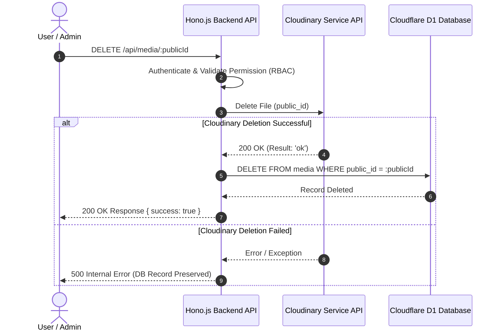

# 87. Cloudinary Media Integration & Delete Flow Specification

## Format Metadata Media di Database
Saat file diunggah ke Cloudinary, metadata berikut **WAJIB** disimpan di tabel `media`:
- `id` (UUID Primary Key)
- `public_id`
- `provider` ("cloudinary")
- `provider_id`
- `secure_url`
- `resource_type` ("image" / "raw" / "video")
- `mime_type`
- `extension`
- `etag`
- `version`
- `folder`
- `width`, `height`, `bytes`
- `uploaded_at`

## Delete Flow (Anti-Orphan File Policy)

